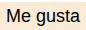
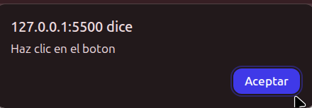
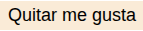

# Botón "Me gusta" interactivo

## Descripción

Este proyecto contiene un botón estilizado que permite al usuario marcar o desmarcar una acción de "Me gusta". Al hacer clic en el botón, se muestra una alerta y cambia el texto del botón para reflejar el estado actual (gustado o no).

## Características

- Botón con estilo CSS personalizado (color, tamaño, sin borde).
- Al hacer clic, aparece una alerta indicando que se hizo clic.
- El texto del botón cambia entre "Me gusta" y "Quitar me gusta".
- Se agrega o remueve una clase CSS `liked` para poder aplicar estilos adicionales si se desea.

## Ver página web

Puedes ver la página publicada en línea en el siguiente enlace:  
[https://nataliagamezbarea.github.io/boton-interactivo/](https://nataliagamezbarea.github.io/boton-interactivo/)

## Archivos

- `index.html` (o el archivo que uses): Contiene el botón, estilos y script para la interacción.

## Uso

Solo abre el archivo en un navegador y haz clic en el botón para ver cómo cambia el texto y se muestra la alerta.
